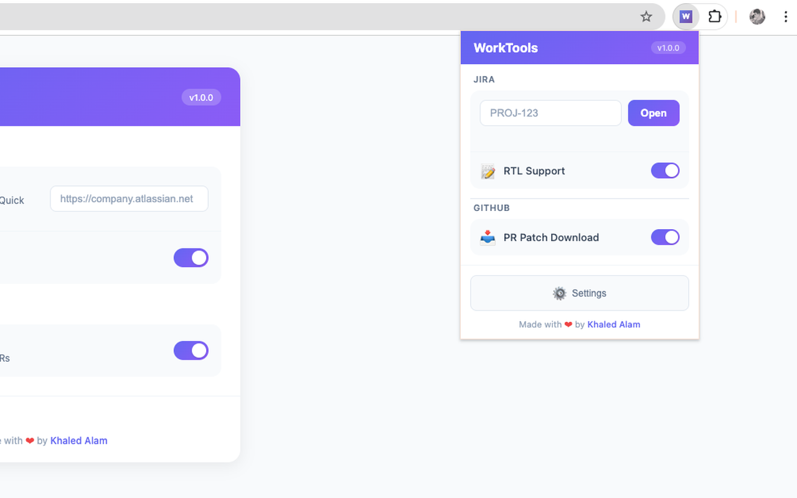
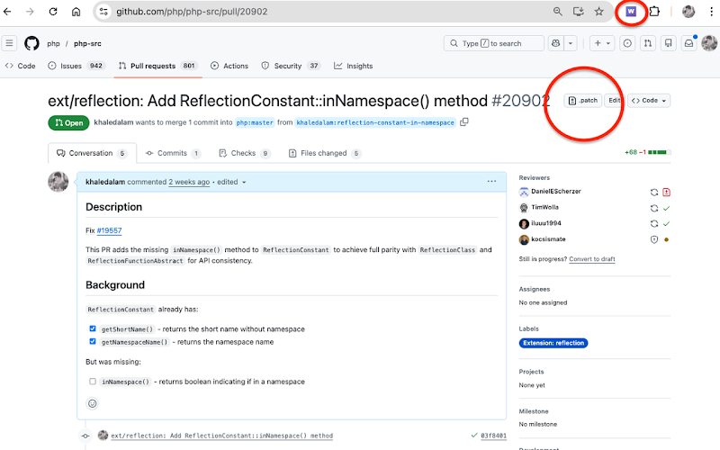
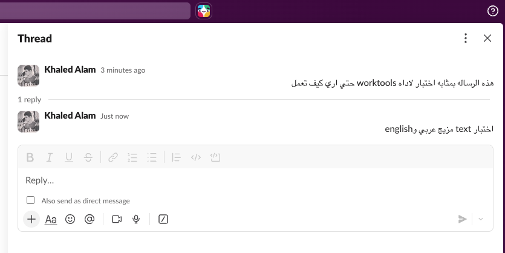

<p align="center">
  <a href="https://khaledalam.github.io/worktools/"></a>
  
  <a href="https://chromewebstore.google.com/detail/worktools/amoikjkckimekcjfkdnkfianhajpdmgc"></a>
  <a href="https://addons.mozilla.org/en-US/firefox/addon/worktools/"></a>
  
</p>

# WorkTools

> **[Visit Website](https://khaledalam.github.io/worktools/)** | Productivity tools for developers who work with JIRA, GitHub, and Slack daily.

<p align="center">
  
</p>

## Platforms

| Platform | Status | Install |
| -------- | ------ | ------- |
| Chrome Extension | ✅ Available | [Chrome Web Store](https://chromewebstore.google.com/detail/worktools/amoikjkckimekcjfkdnkfianhajpdmgc) |
| Firefox Extension | ✅ Available | [Firefox Add-ons](https://addons.mozilla.org/en-US/firefox/addon/worktools/) |
| Mac App | ✅ Available | `brew install khaledalam/worktools/worktools` |
| Windows App | 🚧 Coming Soon | - |
| Linux App | 🚧 Coming Soon | - |

---

## Feature Matrix

| Feature | Chrome | Firefox | Mac | Windows | Linux |
| ------- | :----: | :-----: | :-: | :-----: | :---: |
| Quick JIRA | ✅ | ✅ | ✅ | 🚧 | 🚧 |
| JIRA RTL Support | ✅ | ✅ | ❌ | ❌ | ❌ |
| JIRA Related PRs | ✅ | ❌ | ❌ | ❌ | ❌ |
| GitHub PR Patch | ✅ | ✅ | ❌ | ❌ | ❌ |
| Slack RTL Support | ✅ | ❌ | ❌ | ❌ | ❌ |
| Recent Tickets | ✅ | ✅ | ✅ | 🚧 | 🚧 |
| Keyboard Shortcut | ❌ | ❌ | ✅ | 🚧 | 🚧 |
| Menu Bar App | ❌ | ❌ | ✅ | 🚧 | 🚧 |

---

## Features

### Quick JIRA

Open JIRA tickets instantly without navigating through the browser.

- **Mac:** Menu bar app with keyboard shortcut `Cmd + Shift + J`
- **Browser:** Type `jira PROJ-123` in address bar (omnibox)
- Recent tickets history with timestamps

### JIRA RTL Support

Right-to-left text direction for Hebrew/Arabic content in JIRA.

- Automatic RTL for ticket descriptions, comments, and summaries
- Toggle on/off from extension popup

### JIRA Related PRs Viewer

View linked GitHub pull requests directly in JIRA ticket view.

- Automatically detects GitHub PR links in tickets
- Shows PR status (open, merged, closed, draft)
- Displays additions/deletions count
- Click to open PR in new tab
- Toggle on/off from extension popup

### GitHub PR Patch Download

Quick access to `.patch` files for pull requests.

<p align="center">
  
</p>

- Adds `.patch` button to PR header
- One-click download of PR changes

### Slack RTL Support

Right-to-left text direction for Hebrew/Arabic content in Slack.

<p align="center">
  
</p>

- Automatic RTL for messages, threads, and input
- Preserves LTR for code blocks
- Toggle on/off from extension popup

---

## Installation

### Chrome Extension

Install from [Chrome Web Store](https://chromewebstore.google.com/detail/worktools/amoikjkckimekcjfkdnkfianhajpdmgc)

**Features:**
- Quick JIRA with omnibox support
- JIRA RTL Support
- JIRA Related PRs Viewer
- GitHub PR Patch Download
- Slack RTL Support
- Recent tickets history
- Toggle features on/off from popup

### Firefox Extension

Install from [Firefox Add-ons](https://addons.mozilla.org/en-US/firefox/addon/worktools/)

**Features:**
- Quick JIRA with omnibox support
- JIRA RTL Support
- GitHub PR Patch Download
- Recent tickets history
- Toggle features on/off from popup

### Mac App

```bash
brew install khaledalam/worktools/worktools
```

Or download from [Releases](https://github.com/khaledalam/worktools/releases).

**Features:**
- Menu bar app for quick JIRA access
- Recent tickets history with timestamps
- Keyboard shortcut: `Cmd + Shift + J`
- Settings for JIRA base URL configuration

---

## Configuration

Set your JIRA base URL in Settings:

```
https://company.atlassian.net
```

---

## Privacy

No data collected. All settings stored locally. See [Privacy Policy](PRIVACY_POLICY.md).

---

## Contributing

Issues and PRs welcome at [GitHub](https://github.com/khaledalam/worktools/issues).

---

## Author

**Khaled Alam** - [khaledalam.net](https://khaledalam.net)

---

## License

MIT
